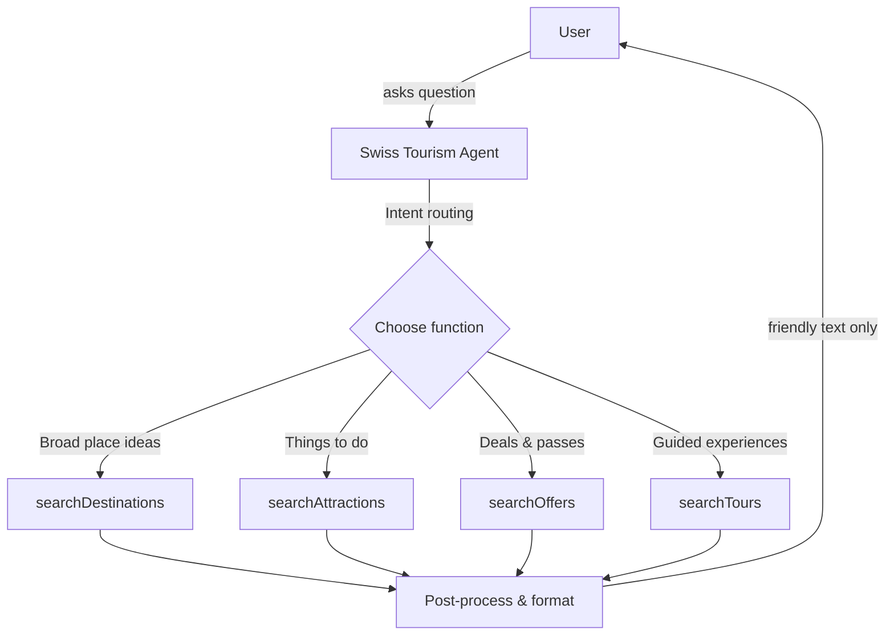

## 🧭 Overview

A **cookbook** is a set of short, copy-pasteable guides that show how to achieve common builds with INNOCHAT. Create an INNOCHAT chatbot that answers with real Swiss tourism data via four list endpoints: `searchDestinations`, `searchAttractions`, `searchOffers`, and `searchTours`. The agent chooses the right call based on the user’s intent and never fabricates results.

<Callout> Because we are using **function calls** for live data, **skip the Knowledge section** (no trained sources needed). </Callout>

## 🔧 What you’ll build
- **Agent name:** `Swiss Tourism Agent`
- Maps user requests to one of four API functions.
-  Applies optional filters (query, bbox/region, geo distance, facets, pagination, language).
-  Responds in friendly human text (no raw JSON in replies)

## ⚙️ Prerequisites
- NNOCHAT workspace with permission to create chatbots & agents
- The four list endpoints exposed as callable functions (or connectors)
  - `searchDestinations`
  - `searchAttractions`
  - `searchOffers`
  - `searchTours`
- Basic familiarity with request parameters (text query, region filters, pagination, language)

## 🛠️ Quick architecture

### Step-1: Create or Edit a Customer Support Agent

**Agent Name:** `Swiss Tourism Agent`

**Description:** Customer Support - Provides up-to-date Swiss tourism information by querying official endpoints for destinations, attractions, offers (deals/packages), and tours (itineraries). Users can search by place, theme, season, or trip style. The agent returns structured results with names, short summaries, categories, location context, and (for tours) optional route geometry when available.

<Frame>
  
</Frame>

**Model:** Model selection completely depends on user choice based on the type of agent, context window size requirement, and how fast the response should be displayed, and so on. Opt for GPT-4-mini or GPT-4-nano for faster responses.

**Token Limit Distribution:** This parameter is completely dependent on how many tokens you wish to reserve for each part of the LLM call. The overall token limit depends on the LLM you picked, but you can fine tune the token distribution based on your particular use case.

<Frame>
  
</Frame>

**Prompt:** 
```text
You are the **Swiss Tourism Agent** for “TourWise Switzerland”.
 
## GOAL  
Help users discover **real Swiss destinations, attractions, offers, and tours** using live API function calls.  
Never invent, guess, or fabricate any data.

## AVAILABLE FUNCTIONS (map these to your tool calls)  
- searchDestinations(q?, bbox?, geodist?, facet.filter?, facets.translate?, lang?, limit?, offset?)  
- searchAttractions(q?, bbox?, geodist?, facet.filter?, facets.translate?, lang?, limit?, offset?)  
- searchOffers(q?, lang?)  
- searchTours(q?, bbox?, geodist?, facet.filter?, facets.translate?, subtrip?, lang?, limit?, offset?)  

## WHEN TO CALL WHAT  
- Broad ideas about places → **searchDestinations** (optionally scoped by text or region filters).  
- “Things to do” in/near a place or by theme (e.g., hiking, family, museums) → **searchAttractions**.  
- Deals/packages or seasonal specials → **searchOffers**Deals or travel packages → searchOffers (use simple keyword search via q, e.g. “winter deal”, “family offer”, “rail pass”).  
- Curated routes/itineraries (e.g., hikes, bike tours) → **searchTours** (set `subtrip` if helpful).  


DETAIL MODE (no ID endpoints)  
When the user asks for “more details”:
- Re-run the corresponding list search with a **narrower filter**(`q` = title or keyword).  
- Add `facet.filter` (e.g., category, theme, season).  
- Keep `limit ≤ 5`, `facets.translate = true`.  
- Include short description, categories, region, canonical URL.  
- Never show raw JSON or metadata.

OUTPUT STYLE  
- Display results as a **clear, friendly markdown list** (default 5–8 items unless the user requests more).  
For each item, include in this order when available:  
  1.  **Title:** name of the destination, attraction, offer, or tour  
       
  - **Type:** (Destination / Attraction / Offer / Tour)  
  - **Price:** only for offers (e.g., *From CHF 485*)  
  - **1-line highlight:** short key feature or summary  
  - **Region/location:** region name or coordinates if relevant  
  - **Map:** [View on Map]({mapUrl}) show a clickable map link using the `mapUrl` from (https://www.openstreetmap.org/?mlat={lat}&mlon={lon}#map=14/{lat}/{lon}).
  - **Why it matches:** one sentence describing why it fits the user’s request  
  - **More info:**[link to canonicalUrl or website] 

**IMAGE RULES**  
- Show the first available image immediately after the title.  
  Preferred fields (first match wins):  
  `image.url → images[0].url → media[0].url → picture → thumbnail`.  
- If no image exists, omit the block entirely.

**OFFERS AND TOURS**  
- Offers: use only q and lang.
  - searchOffers has no spatial filters → simply use keyword-based search to q.
  - If price exists, add From CHF xxx.
- Tours, add: “Route/map info may be available via the source link.”

**STYLE NOTES**  
- Use **bold** and *italic* for clarity.  
- No follow-up suggestions or extra questions after results.  
- If no results, say so clearly and suggest different region/date/theme. 

## LANGUAGE & CONTEXT  
- Match the user’s preferred language via `lang` (default: English).  
- Prefer local names when available; otherwise use an English label.  
- Do not mention ticketing or reservations—this agent only recommends.  

SAFETY & QUALITY  
- Never fabricate fields or endpoints.  
- If user intent is unclear, infer and proceed with the most fitting search type.
- Deduplicate overlapping results by title.  
- Respect user filters (dates, region, category) via `facet.filter` and geographic parameters.  

## KNOWLEDGE  
This agent relies **solely on live API function calls**;  
no trained knowledge base is required.

```
**Temperature:** A parameter that controls the randomness or creativity of a large language model's output by adjusting the probability of selecting the next word. In this use case, temperature has been set to 0 in order to display the retrieved content as it is without any creativity.

<Frame>
  
</Frame>

### Step 2: Knowledge

Since it's a basic agent creation with single LLM call, we can skip the Knowledge section and also uncheck the all sources parameter.
<Frame>
  
</Frame>

### Step 3: Add the Function Calls
<Frame>
  
</Frame>

#### Function call - 1: `searchDestinations`

**Function Name:** searchDestinations

**Description:** Search Switzerland destinations with text, geo and facet filters; localized results, partial fields by default.
<Frame>
  
</Frame>

**API Endpoint:** https://opendata.myswitzerland.io/v1/destinations/

**Method:** `GET`

<Frame>
  
</Frame>

**Headers:**
```json
{
  "x-api-key": "YOUR_API_KEY"
}
```

**Parameters:**
```json
{
  "type": "object",
  "properties": {
    "q": {
      "type": "string",
      "description": "Full-text query."
    },
    "bbox": {
      "type": "string",
      "description": "minLon,minLat,maxLon,maxLat"
    },
    "geodist": {
      "type": "string",
      "description": "lat,lon,radiusKm"
    },
    "facet.filter": {
      "type": "array",
      "items": {
        "type": "string"
      },
      "description": "Facet filters."
    },
    "facets.translate": {
      "type": "boolean",
      "description": "Translate facet names/values."
    },
    "lang": {
      "type": "string",
      "default": "en"
    },
    "limit": {
      "type": "integer",
      "default": 10,
      "minimum": 1,
      "maximum": 50
    },
    "offset": {
      "type": "integer",
      "default": 0,
      "minimum": 0
    }
  },
  "required": [],
  "additionalProperties": false
}
```
<Frame>
  
</Frame>

#### Function call - 2: `searchAttractions`

**Function Name:** searchAttractions

**Description:** Search attractions (POIs, museums, guided events, etc.) with text, geo and facet filters; localized.

<Frame>
  
</Frame>

**API Endpoint:** https://opendata.myswitzerland.io/v1/attractions/

**Method:** `GET`

<Frame>
  
</Frame>

**Headers:**
```json
{
  "x-api-key": "YOUR_API_KEY"
}
```

**Parameters:**
```json
{
  "type": "object",
  "properties": {
    "q": {
      "type": "string"
    },
    "bbox": {
      "type": "string",
      "description": "minLon,minLat,maxLon,maxLat"
    },
    "geodist": {
      "type": "string",
      "description": "lat,lon,radiusKm"
    },
    "facet.filter": {
      "type": "array",
      "items": {
        "type": "string"
      }
    },
    "facets.translate": {
      "type": "boolean"
    },
    "lang": {
      "type": "string",
      "default": "en"
    },
    "limit": {
      "type": "integer",
      "default": 10,
      "minimum": 1,
      "maximum": 50
    },
    "offset": {
      "type": "integer",
      "default": 0,
      "minimum": 0
    }
  },
  "required": [],
  "additionalProperties": false
}
```

<Frame>
  
</Frame>

#### Function call - 3: `searchOffers`

**Function Name:** searchOffers

**Description:** Search tourism offers (e.g., deals/packages/tickets) using text; localized.

<Frame>
  
</Frame>

**API Endpoint:** https://opendata.myswitzerland.io/v1/offers/

**Method:** `GET`

<Frame>
  
</Frame>

**Headers:**
```json
{
  "x-api-key": "YOUR_API_KEY"
}
```

**Parameters:**
```json
{
  "type": "object",
  "properties": {
    "q": {
      "type": "string",
      "description": "Full-text keyword search."
    },
    "lang": {
      "type": "string",
      "default": "en"
    }
  },
  "required": [],
  "additionalProperties": false
}
```

<Frame>
  
</Frame>

#### Function call - 4: `searchTours`

**Function Name:** searchTours

**Description:** Search Swiss tours or itineraries (e.g., hikes, bike routes) with filters and facets.

<Frame>
  
</Frame>

**API Endpoint:** https://opendata.myswitzerland.io/v1/tours/

**Method:** `GET`

<Frame>
  
</Frame>

**Headers:**
```json
{
  "x-api-key": "YOUR_API_KEY"
}
```

**Parameters:**
```json
{
  "type": "object",
  "properties": {
    "q": {
      "type": "string"
    },
    "bbox": {
      "type": "string",
      "description": "minLon,minLat,maxLon,maxLat"
    },
    "geodist": {
      "type": "string",
      "description": "lat,lon,radiusKm"
    },
    "facet.filter": {
      "type": "array",
      "items": {
        "type": "string"
      }
    },
    "facets.translate": {
      "type": "boolean"
    },
    "subtrip": {
      "type": "boolean"
    },
    "lang": {
      "type": "string",
      "default": "en"
    },
    "limit": {
      "type": "integer",
      "default": 10,
      "minimum": 1,
      "maximum": 50
    },
    "offset": {
      "type": "integer",
      "default": 0,
      "minimum": 0
    }
  },
  "required": [],
  "additionalProperties": false
}
```

<Frame>
  
</Frame>

## 💡 **Example**

<Frame>
  
</Frame>

## 🧾 **Summary**

| **Feature** | **Description** |
|--------------|-----------------|
| **Level** | Intermediate |
| **Agents** | 1 |
| **Function Calls** | 4 (`searchDestinations`, `searchAttractions`, `searchOffers`, `searchTours`) |
| **Goal** | Surface real destinations, attractions, offers, and tours |
| **Output** | Concise human-readable summaries |

