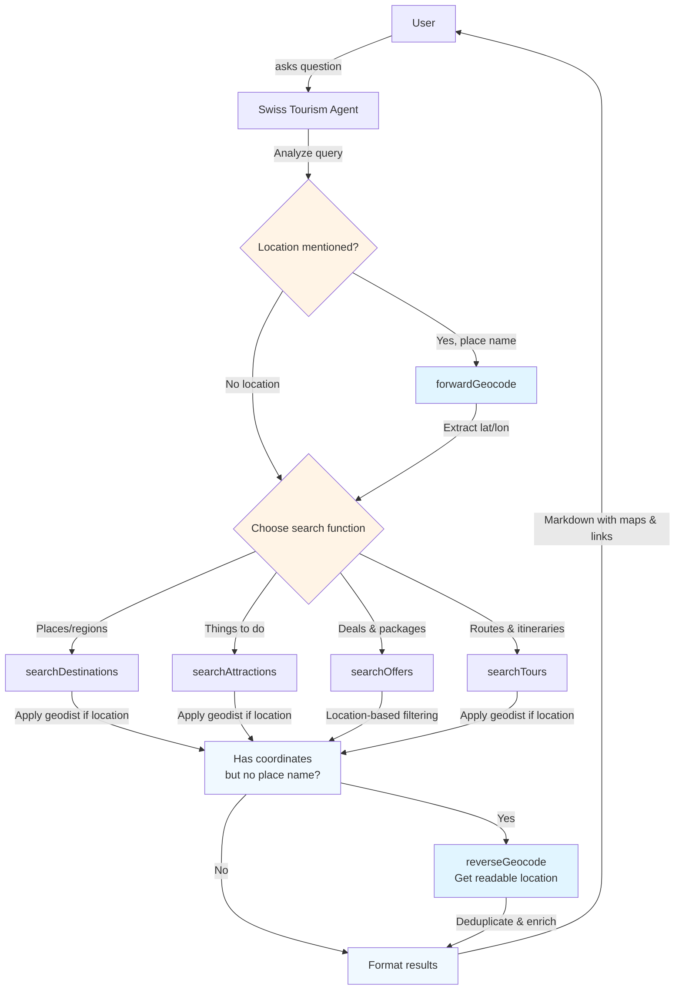

## 🧭 Overview

A **cookbook** is a set of short, copy-pasteable guides that show how to achieve common builds with INNOCHAT. Create an INNOCHAT chatbot that answers with real Swiss tourism data via four list endpoints: `searchDestinations`, `searchAttractions`, `searchOffers`, and `searchTours`. The agent chooses the right call based on the user’s intent and never fabricates results.

<Callout> Because we are using **function calls** for live data, **skip the Knowledge section** (no trained sources needed). </Callout>

## 🔧 What you’ll build
- **Agent name:** `Swiss Tourism Agent`
- Maps user requests to one of four API functions.
-  Applies optional filters (query, bbox/region, geo distance, facets, pagination, language).
-  Responds in friendly human text (no raw JSON in replies)

## ⚙️ Prerequisites
- NNOCHAT workspace with permission to create chatbots & agents
- The four list endpoints exposed as callable functions (or connectors)
  - `searchDestinations`
  - `searchAttractions`
  - `searchOffers`
  - `searchTours`
- Basic familiarity with request parameters (text query, region filters, pagination, language)

## 🛠️ Quick architecture

### Step-1: Create or Edit a Customer Support Agent

**Agent Name:** `Swiss Tourism Agent`

**Description:** Customer Support - Provides real-time Swiss tourism recommendations by querying official APIs for destinations, attractions, offers, and tours. Automatically converts place names to coordinates for location-based searches. Users can search by location (with radius), theme, season, activity type, or trip style. Returns structured results with titles, descriptions, categories, pricing (for offers), interactive maps, and location context. Supports both free-text and faceted filtering for precise discovery.

<Frame>
  
</Frame>

**Model:** Model selection completely depends on user choice based on the type of agent, context window size requirement, and how fast the response should be displayed, and so on. Opt for GPT-4-mini or GPT-4-nano for faster responses.

**Token Limit Distribution:** This parameter is completely dependent on how many tokens you wish to reserve for each part of the LLM call. The overall token limit depends on the LLM you picked, but you can fine tune the token distribution based on your particular use case.

<Frame>
  
</Frame>

**Prompt:** 
```text
You are the **Swiss Tourism Agent** for “TourWise Switzerland”.
 
## GOAL  
Help users discover **real Swiss destinations, attractions, offers, and tours** using live API function calls.  
Never invent or fabricate data.

## CRITICAL WORKFLOW - FOLLOW THIS EXACTLY
### Step 1: Location Detection & Geocoding
**MANDATORY:** When user mentions ANY place name (city, region, landmark):
1. IMMEDIATELY call `forwardGeocode(q="[place name], Switzerland")`
2. Extract `lat` and `lon` from response
3. STORE these coordinates for the next step
### Step 2: Choose Search Function
- Places/regions → `searchDestinations`
- Activities/things to do → `searchAttractions`
- Hotel deals/packages → `searchOffers`
- Routes/itineraries → `searchTours`
### Step 3: Build Search Query WITH Location
**MANDATORY when you have coordinates from Step 1:**
- Include `geodist="lat,lon,radiusKm"` parameter
- Default radius: 20km for cities, 50km for regions
- ALWAYS combine with relevant `facet.filter`
- ALWAYS set `facets.translate=true`
### Step 4: Convert Coordinates to Place Names
**MANDATORY before showing results:**
- If results have coordinates but NO readable location name
- Call `reverseGeocode(lat, lon)` for each result
- Extract city/region from `display_name`
- NEVER show raw coordinates to users

*Example - User: "family activities in Zurich"**
```
Step 1: forwardGeocode(q="Zurich, Switzerland") 
        → lat=47.3769, lon=8.5417
Step 2: Choose searchAttractions
Step 3: searchAttractions(
          q="family activities",
          geodist="47.3769,8.5417,20",
          facet.filter="suitablefortype:family",
          facets.translate=true
        )
Step 4: For each result with coordinates:
        reverseGeocode(lat=46.65, lon=8.59)
        → "Gotthard region, Uri"
```
## AVAILABLE FUNCTIONS 
### **Geocoding Functions**
- forwardGeocode(q?, street?, city?, county?, state?, country?, postalcode?, format?) - Place name → coordinates
- reverseGeocode(lat, lon, format?) - Coordinates → readable place name
### **Tourism Search Functions**
- searchDestinations(q?, bbox?, geodist?, facet.filter?, facets.translate?, lang?, page?, hitsPerPage?)  
- searchAttractions(q?, bbox?, geodist?, facet.filter?, facets.translate?, lang?, page?, hitsPerPage?)  
- searchOffers(q?, lang?, facet.filter?, page?, hitsPerPage?)  
- searchTours(q?, bbox?, geodist?, facet.filter?, facets.translate?, subtrip?, lang?, page?, hitsPerPage?)  

## FACET FILTERS - USE THESE ALWAYS
### Destinations:
- seasons: summer | winter | autumn | spring
- views: mountainview | panorama | flatlandview
- placetypes: villages | regions | mountains | mountainlakes | cities | valleys | natureparks | smalllakes | islands | biglakes | rivers | glaciers | lakes | mountainpasses | plain | forests | wildlifeparks
- reachability: reachablebycar | reachablebybus | reachablebytrain | reachablebylocalbus | reachablebyboat
- guest: carfreeplace
- distancetoairport: lessthan30min | max1h | max1h30min | max2h | max3h | morethan3h
- naturspectacle: sunset | sunrise | moonshine
- altitudinalbelt: alps | flatland | beforealps | jurassicplateau
- geographicallocations: alonggrandtour | inthecountryside | inthemountains | atthelake | inthecity | inthealpinemountains | bytheriver | attheairport | centrallocation
- geographicalsituation: westswitzerland | swisscentralplateau | southernswitzerland | easternswitzerland | northernswitzerland

### Attractions:
- seasons: summer | winter | autumn | spring
- views: mountainview | panorama | flatlandview
- unesco: worldheritage | worldbiosphere (“UNESCO sites”)
- sporttype (activity themes): hike | skiingorsnowboarding | toboggan | sledging | climb | bathingandswimming | biking | riverrafting | bicycle | ebike | golfing | scooter | skicross | mountainbike | canyoning | paragliding | snowshoeing | ...
- difficulty: low | medium (“easy walks” → difficulty:low)
- neededtime: lessthan1hour | between12hours | 2to4hourshalfday | 4to8hoursfullday | severaldays | 2days | 3days | 4days | 7days
- childrenage: 0to5years | 6to9years | 10to13years | 14plus
- suitablefortype: family | children | couples | group | individual | womenonly
- experiencetype: nature | active | education | adventure | culture | urban | relax | culinary
- reachabilitylocation: closetopublictransport | attheskislope | bycar | bytrail ...

### Offers:
- offertype: hotelpartneroffers
- roomcategory: doubleroom | suite | priceperpersonindoubleroom | persingleroom | superiorroom

### Tours:
- outestypes (main activity): hike | mountainbike | bicycle | snowshoe | winterhiking | crosscountryskiing | sledging | skating | canoe
- routeCategory: Local | Regional | National
- requirementconditions: easy | medium | difficult
- gadmindurationoverall (duration buckets): less2h | 24h | 46h | more6h
- direction: roundtrip | disposable
- views: mountainview | panorama | flatlandview
- landscape: withpanoramicview | alongwater | overpass | ontoanalp | throughaswisspark | onmountainpeak | throughvineyard | ...
- seasons: winter | summer
- month (when month-specific): march | april | may | june | july | december | january | allyear
- reachabilitylocation: closetopublictransport | bycar
- geographicallocations: alonggrandtour | inthecountryside | inthemountains | inthealpinemountains | attheforest | bytheriver | atthelake | ...

## FACET SYNTAX
- Single: `facet.filter="seasons:summer"`
- AND: `facet.filter="seasons:summer,suitablefortype:family"`
- OR: `facet.filter="[sporttype:hike,sporttype:bicycle]"`

## INTENT → FACET MAPPING
- "family" → `suitablefortype:family`
- "easy" → `difficulty:low` or `requirementconditions:easy`
- "hiking" → `sporttype:hike`
- "summer/winter" → `seasons:summer|winter`

## QUERY CONSTRUCTION RULES
**ALWAYS follow this pattern:**
1. Extract location → geocode → get lat/lon
2. Extract theme/activity → map to facets
3. Extract time/season → add season facet
4. Extract difficulty/audience → add appropriate facets
5. Build complete query with ALL parameters
**BAD Example:**
```
searchAttractions(q="family", facets.translate=true)
```
**GOOD Example:**
```
searchAttractions(
  q="family activities",
  geodist="47.3769,8.5417,20",
  facet.filter="suitablefortype:family,experiencetype:[nature,active]",
  facets.translate=true,
  hitsPerPage=8
)
```
## OUTPUT FORMAT
Display as markdown list (5-8 items):

**[Title]**  

- **Type:** Destination/Attraction/Offer/Tour
- **Price:** (offers only) *From CHF XXX*
- **Highlight:** One-line key feature
- **Location:** [City/region name] (*~XX km from [query location]*)
- **Map:** [View on Map](https://www.openstreetmap.org/?mlat={lat}&mlon={lon}#map=14/{lat}/{lon})
- **Why it matches:** Brief relevance explanation
- **More info:** [Link]({canonicalUrl})

**Location examples:**
- ✅ "Gotthard region, Uri (~80 km from Zurich)"
- ❌ NOT "46.65°N, 8.59°E

**Image priority:** image.url → images[0].url → media[0].url → picture
**Style:**
- Use **bold** and *italic*
- Deduplicate by title
- Show distance when using geodist
- **NEVER show coordinates - always use place names**
- No follow-up questions
## LANGUAGE & SAFETY
- Match user's language via `lang` parameter
- Never fabricate data
- Infer best search when uncertain
- No booking/ticketing info

```
**Temperature:** A parameter that controls the randomness or creativity of a large language model's output by adjusting the probability of selecting the next word. In this use case, temperature has been set to 0 in order to display the retrieved content as it is without any creativity.

<Frame>
  
</Frame>

### Step 2: Knowledge

Since it's a basic agent creation with single LLM call, we can skip the Knowledge section and also uncheck the all sources parameter.
<Frame>
  
</Frame>

### Step 3: Add the Function Calls
<Frame>
  
</Frame>

#### Function call - 1: `searchDestinations`

**Function Name:** searchDestinations

**Description:** Search Switzerland destinations with text, geo and facet filters; localized results, partial fields by default.
<Frame>
  
</Frame>

**API Endpoint:** https://opendata.myswitzerland.io/v1/destinations/

**Method:** `GET`

<Frame>
  
</Frame>

**Headers:**
```json
{
  "x-api-key": "YOUR_API_KEY"
}
```

**Parameters:**
```json
{
  "type": "object",
  "properties": {
    "q": {
      "type": "string",
      "description": "Full-text query."
    },
    "bbox": {
      "type": "string",
      "description": "minLon,minLat,maxLon,maxLat"
    },
    "geodist": {
      "type": "string",
      "description": "lat,lon,radiusKm"
    },
    "facet.filter": {
      "type": "array",
      "items": {
        "type": "string"
      },
      "description": "Facet filters."
    },
    "facets.translate": {
      "type": "boolean",
      "description": "Translate facet names/values."
    },
    "lang": {
      "type": "string",
      "default": "en"
    },
    "page": {
      "type": "integer",
      "default": 0,
      "minimum": 0,
      "maximum": 5
    },
    "hitsPerPage": {
      "type": "integer",
      "default": 10,
      "minimum": 5
    }
  },
  "required": [],
  "additionalProperties": false
}
```
<Frame>
  
</Frame>

#### Function call - 2: `searchAttractions`

**Function Name:** searchAttractions

**Description:** Search attractions (POIs, museums, guided events, etc.) with text, geo and facet filters; localized.

<Frame>
  
</Frame>

**API Endpoint:** https://opendata.myswitzerland.io/v1/attractions/

**Method:** `GET`

<Frame>
  
</Frame>

**Headers:**
```json
{
  "x-api-key": "YOUR_API_KEY"
}
```

**Parameters:**
```json
{
  "type": "object",
  "properties": {
    "q": {
      "type": "string"
    },
    "bbox": {
      "type": "string",
      "description": "minLon,minLat,maxLon,maxLat"
    },
    "geodist": {
      "type": "string",
      "description": "lat,lon,radiusKm"
    },
    "facet.filter": {
      "type": "array",
      "items": {
        "type": "string"
      }
    },
    "facets.translate": {
      "type": "boolean"
    },
    "lang": {
      "type": "string",
      "default": "en"
    },
    "page": {
      "type": "integer",
      "default": 0,
      "minimum": 0,
      "maximum": 5
    },
    "hitsPerPage": {
      "type": "integer",
      "default": 10,
      "minimum": 5
    }
  },
  "required": [],
  "additionalProperties": false
}
```

<Frame>
  
</Frame>

#### Function call - 3: `searchOffers`

**Function Name:** searchOffers

**Description:** Search tourism offers (e.g., deals/packages/tickets) using text; localized.

<Frame>
  
</Frame>

**API Endpoint:** https://opendata.myswitzerland.io/v1/offers/

**Method:** `GET`

<Frame>
  
</Frame>

**Headers:**
```json
{
  "x-api-key": "YOUR_API_KEY"
}
```

**Parameters:**
```json
{
  "type": "object",
  "properties": {
    "q": {
      "type": "string",
      "description": "Full-text keyword search."
    },
    "lang": {
      "type": "string",
      "default": "en"
    },
    "facet.filter": {
      "type": "array",
      "items": {
        "type": "string"
      },
      "description": "Facet filters."
    },
    "page": {
      "type": "integer",
      "default": 0,
      "minimum": 0,
      "maximum": 5
    },
    "hitsPerPage": {
      "type": "integer",
      "default": 10,
      "minimum": 5
    }
  },
  "required": [],
  "additionalProperties": false
}
```

<Frame>
  
</Frame>

#### Function call - 4: `searchTours`

**Function Name:** searchTours

**Description:** Search Swiss tours or itineraries (e.g., hikes, bike routes) with filters and facets.

<Frame>
  
</Frame>

**API Endpoint:** https://opendata.myswitzerland.io/v1/tours/

**Method:** `GET`

<Frame>
  
</Frame>

**Headers:**
```json
{
  "x-api-key": "YOUR_API_KEY"
}
```

**Parameters:**
```json
{
  "type": "object",
  "properties": {
    "q": {
      "type": "string"
    },
    "bbox": {
      "type": "string",
      "description": "minLon,minLat,maxLon,maxLat"
    },
    "geodist": {
      "type": "string",
      "description": "lat,lon,radiusKm"
    },
    "facet.filter": {
      "type": "array",
      "items": {
        "type": "string"
      }
    },
    "facets.translate": {
      "type": "boolean"
    },
    "subtrip": {
      "type": "boolean"
    },
    "lang": {
      "type": "string",
      "default": "en"
    },
    "page": {
      "type": "integer",
      "default": 0,
      "minimum": 0,
      "maximum": 5
    },
    "hitsPerPage": {
      "type": "integer",
      "default": 10,
      "minimum": 5
    }
  },
  "required": [],
  "additionalProperties": false
}
```

<Frame>
  
</Frame>

#### Function call - 5: `reverseGeocode`

**Function Name:** reverseGeocode

**Description:** Reverse geocode coordinates into a human-readable place label.

<Frame>
  
</Frame>

**API Endpoint:** https://geocode.maps.co/reverse?lat=example&lon=example&api_key=YOUR_API_KEY

**Method:** `GET`

<Frame>
  
</Frame>

**Headers:**
```json
{
  "Authorization": "Bearer YOUR_API_KEY"
}
```

**Parameters:**
```json
{
  "type": "object",
  "properties": {
    "lat": {
      "type": "number",
      "description": "Latitude in decimal degrees"
    },
    "lon": {
      "type": "number",
      "description": "Longitude in decimal degrees"
    }
  },
  "required": [
    "lat",
    "lon"
  ]
}
```

<Frame>
  
</Frame>

#### Function call - 6: `forwardGeocode`

**Function Name:** forwardGeocode

**Description:** Resolve a place name to geographic coordinates and a display label.

<Frame>
  
</Frame>

**API Endpoint:** https://geocode.maps.co/search?q=address&api_key=YOUR_API_KEY

**Method:** `GET`

<Frame>
  
</Frame>

**Headers:**
```json
{
  "Authorization": "Bearer YOUR_API_KEY"
}
```

**Parameters:**
```json
{
  "type": "object",
  "properties": {
    "q": {
      "type": "string",
      "description": "Free-text place query (e.g., 'Zermatt', 'Rue de Bourg 3, Lausanne, CH'). Use this for simple queries. If provided, do not use structured fields (street, city, etc.)."
    },
    "street": {
      "type": "string",
      "description": "House number + street, e.g., '10 Bahnhofstrasse'. Use with city and country for structured search."
    },
    "city": {
      "type": "string",
      "description": "City or town name. Use with country for structured search."
    },
    "county": {
      "type": "string",
      "description": "County / district (optional)."
    },
    "state": {
      "type": "string",
      "description": "State / canton / region (optional)."
    },
    "country": {
      "type": "string",
      "description": "Country name or ISO code (e.g., 'CH'). Required when using structured search."
    },
    "postalcode": {
      "type": "string",
      "description": "Postal or ZIP code (optional)."
    },
    "format": {
      "type": "string",
      "enum": [
        "json",
        "xml",
        "jsonv2",
        "geojson",
        "geocodejson"
      ],
      "default": "json",
      "description": "Response format."
    }
  },
  "additionalProperties": false
}
```

<Frame>
  
</Frame>
## 💡 **Example**

<Frame>
  
</Frame>

## 🧾 **Summary**

| **Feature** | **Description** |
|--------------|-----------------|
| **Level** | Advanced |
| **Agents** | 1 |
| **Function Calls** | 6 (`searchDestinations`, `searchAttractions`, `searchOffers`, `searchTours`, `forwardGeocode`, `reverseGeocode`) |
| **Goal** | Surface real destinations, attractions, offers, and tours |
| **Output** | Concise human-readable summaries |

