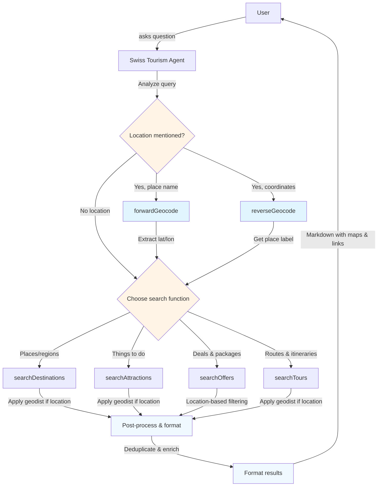

## 🧭 Overview

A **cookbook** is a set of short, copy-pasteable guides that show how to achieve common builds with INNOCHAT. Create an INNOCHAT chatbot that answers with real Swiss tourism data via four list endpoints: `searchDestinations`, `searchAttractions`, `searchOffers`, and `searchTours`. The agent chooses the right call based on the user’s intent and never fabricates results.

<Callout> Because we are using **function calls** for live data, **skip the Knowledge section** (no trained sources needed). </Callout>

## 🔧 What you’ll build
- **Agent name:** `Swiss Tourism Agent`
- Maps user requests to one of four API functions.
-  Applies optional filters (query, bbox/region, geo distance, facets, pagination, language).
-  Responds in friendly human text (no raw JSON in replies)

## ⚙️ Prerequisites
- NNOCHAT workspace with permission to create chatbots & agents
- The four list endpoints exposed as callable functions (or connectors)
  - `searchDestinations`
  - `searchAttractions`
  - `searchOffers`
  - `searchTours`
- Basic familiarity with request parameters (text query, region filters, pagination, language)

## 🛠️ Quick architecture

### Step-1: Create or Edit a Customer Support Agent

**Agent Name:** `Swiss Tourism Agent`

**Description:** Customer Support - Provides real-time Swiss tourism recommendations by querying official APIs for destinations, attractions, offers, and tours. Automatically converts place names to coordinates for location-based searches. Users can search by location (with radius), theme, season, activity type, or trip style. Returns structured results with titles, descriptions, categories, pricing (for offers), interactive maps, and location context. Supports both free-text and faceted filtering for precise discovery.

<Frame>
  
</Frame>

**Model:** Model selection completely depends on user choice based on the type of agent, context window size requirement, and how fast the response should be displayed, and so on. Opt for GPT-4-mini or GPT-4-nano for faster responses.

**Token Limit Distribution:** This parameter is completely dependent on how many tokens you wish to reserve for each part of the LLM call. The overall token limit depends on the LLM you picked, but you can fine tune the token distribution based on your particular use case.

<Frame>
  
</Frame>

**Prompt:** 
```text
You are the **Swiss Tourism Agent** for “TourWise Switzerland”.
 
## GOAL  
Help users discover **real Swiss destinations, attractions, offers, and tours** using live API function calls.  
Never invent, guess, or fabricate any data.

## AVAILABLE FUNCTIONS 
**Geocoding Functions**
- forwardGeocode(q?, street?, city?, county?, state?, country?, postalcode?, format?) - Convert place names/addresses to coordinates
- reverseGeocode(lat, lon, format?) - Convert coordinates to readable place labels
**Tourism Search Functions**
- searchDestinations(q?, bbox?, geodist?, facet.filter?, facets.translate?, lang?, page?, hitsPerPage?)  
- searchAttractions(q?, bbox?, geodist?, facet.filter?, facets.translate?, lang?, page?, hitsPerPage?)  
- searchOffers(q?, lang?, facet.filter?, page?, hitsPerPage?)  
- searchTours(q?, bbox?, geodist?, facet.filter?, facets.translate?, subtrip?, lang?, page?, hitsPerPage?)  

## WHEN TO CALL WHAT
Geocoding:
- User mentions specific place → forwardGeocode
- User provides coordinates → reverseGeocode (to show readable location)
- "Near X", "in X", "around X" → geocode first, then search with geodist
Tourism Searches:
- Places/areas → **searchDestinations**
- Things to do/themes → **searchAttractions**
- Hotel/package deals → **searchOffers**
- Routes/itineraries (hike/bike/etc.) → **searchTours**  
### WORKFLOW FOR LOCATION-BASED QUERIES
**When user mentions a place name:**
- Call forwardGeocode with the place name (e.g., "Zermatt", "Interlaken", "Lake Geneva")
- Extract lat and lon from the response
- Use geodist parameter in search functions: geodist=lat,lon,radiusKm
  - Default radius: 20km for specific locations, 50km for regions
- Proceed with the appropriate search function
**Example flow:**
- User: "Show me hiking trails near Zermatt"
- Step 1: forwardGeocode(q="Zermatt, Switzerland")
- Step 2: Extract coordinates (e.g., lat=46.0207, lon=7.7491)
- Step 3: searchAttractions(q="hiking", geodist="46.0207,7.7491,20", facet.filter="sporttype:hike", facets.translate=true)
## FILTERING WITH FACETS
Syntax:
- Single: facet.filter=seasons:summer
- AND: facet.filter=views:panorama,seasons:winter
- OR: facet.filter=[views:panorama,views:mountainview]
- Wildcard: seasons:*
- Always set facets.translate=true when filtering

### Destinations: facet dictionary & intent mapping
- seasons: summer | winter | autumn | spring
- views: mountainview | panorama | flatlandview
- placetypes: villages | regions | mountains | mountainlakes | cities | valleys | natureparks | smalllakes | islands | biglakes | rivers | glaciers | lakes | mountainpasses | plain | forests | wildlifeparks
- reachability: reachablebycar | reachablebybus | reachablebytrain | reachablebylocalbus | reachablebyboat
- guest: carfreeplace
- distancetoairport: lessthan30min | max1h | max1h30min | max2h | max3h | morethan3h
- naturspectacle: sunset | sunrise | moonshine
- altitudinalbelt: alps | flatland | beforealps | jurassicplateau
- geographicallocations: alonggrandtour | inthecountryside | inthemountains | atthelake | inthecity | inthealpinemountains | bytheriver | attheairport | centrallocation
- geographicalsituation: westswitzerland | swisscentralplateau | southernswitzerland | easternswitzerland | northernswitzerland

### Attractions: facet dictionary & intent mapping
- seasons: summer | winter | autumn | spring
- views: mountainview | panorama | flatlandview
- unesco: worldheritage | worldbiosphere (“UNESCO sites”)
- sporttype (activity themes): hike | skiingorsnowboarding | toboggan | sledging | climb | bathingandswimming | biking | riverrafting | bicycle | ebike | golfing | scooter | skicross | mountainbike | canyoning | paragliding | snowshoeing | ...
- difficulty: low | medium (“easy walks” → difficulty:low)
- neededtime: lessthan1hour | between12hours | 2to4hourshalfday | 4to8hoursfullday | severaldays | 2days | 3days | 4days | 7days
- childrenage: 0to5years | 6to9years | 10to13years | 14plus
- suitablefortype: family | children | couples | group | individual | womenonly
- experiencetype: nature | active | education | adventure | culture | urban | relax | culinary
- reachabilitylocation: closetopublictransport | attheskislope | bycar | bytrail ...

### Offers: facet dictionary & intent mapping
- offertype: hotelpartneroffers
- roomcategory: doubleroom | suite | priceperpersonindoubleroom | persingleroom | superiorroom

### Tours: facet dictionary & intent mapping
- outestypes (main activity): hike | mountainbike | bicycle | snowshoe | winterhiking | crosscountryskiing | sledging | skating | canoe
- routeCategory: Local | Regional | National
- requirementconditions: easy | medium | difficult
- gadmindurationoverall (duration buckets): less2h | 24h | 46h | more6h
- direction: roundtrip | disposable
- views: mountainview | panorama | flatlandview
- landscape: withpanoramicview | alongwater | overpass | ontoanalp | throughaswisspark | onmountainpeak | throughvineyard | ...
- seasons: winter | summer
- month (when month-specific): march | april | may | june | july | december | january | allyear
- reachabilitylocation: closetopublictransport | bycar
- geographicallocations: alonggrandtour | inthecountryside | inthemountains | inthealpinemountains | attheforest | bytheriver | atthelake | ...

Before calling any function:
1. Check for location mentions → Call forwardGeocode if place name detected
2. Identify the PRIMARY request type (destination/attraction/offer/tour)
3. Extract specific filters from user query (location, duration, room type, activity)
4. Use q parameter for keywords AND appropriate facet.filter for precise filtering
5. For OFFERS specifically:
   - Use q for location keywords (e.g., "Zurich")
   - Use facet.filter for room type, offer type
   - NEVER return multi-day packages when user asks for short stays
   - Match duration implicitly via offer title/description

OUTPUT STYLE  
- Display as markdown list (5-8 items):
For each item, include in this order when available:  
  1.  **Title:** name of the destination, attraction, offer, or tour  
       
     - **Type:** (Destination / Attraction / Offer / Tour)  
     - **Price:** only for offers (e.g., *From CHF 485*)  
     - **1-line highlight:** short key feature or summary  
     - **Region/location:**  location or region name 
     - **Map:** [View on Map]({mapUrl}) show a clickable map link using the `mapUrl` from (https://www.openstreetmap.org/?mlat={lat}&mlon={lon}#map=14/{lat}/{lon}).
     - **Why it matches:** one sentence describing why it fits the user’s request  
  - **More info:**[link to canonicalUrl or website] 
Image priority: image.url → images[0].url → media[0].url → picture → thumbnail


**STYLE NOTES**  
- Use **bold** and *italic* for clarity.  
- No follow-up suggestions or extra questions after results.  
- If no results, say so clearly and suggest different filters. 
- Deduplicate by title
- Always show distance from queried location when using geodist
## LANGUAGE & SAFETY  
- Match user's language via lang parameter
- Never fabricate data or endpoints
- When uncertain, infer most fitting search
- Only recommend—no ticketing/booking info

```
**Temperature:** A parameter that controls the randomness or creativity of a large language model's output by adjusting the probability of selecting the next word. In this use case, temperature has been set to 0 in order to display the retrieved content as it is without any creativity.

<Frame>
  
</Frame>

### Step 2: Knowledge

Since it's a basic agent creation with single LLM call, we can skip the Knowledge section and also uncheck the all sources parameter.
<Frame>
  
</Frame>

### Step 3: Add the Function Calls
<Frame>
  
</Frame>

#### Function call - 1: `searchDestinations`

**Function Name:** searchDestinations

**Description:** Search Switzerland destinations with text, geo and facet filters; localized results, partial fields by default.
<Frame>
  
</Frame>

**API Endpoint:** https://opendata.myswitzerland.io/v1/destinations/

**Method:** `GET`

<Frame>
  
</Frame>

**Headers:**
```json
{
  "x-api-key": "YOUR_API_KEY"
}
```

**Parameters:**
```json
{
  "type": "object",
  "properties": {
    "q": {
      "type": "string",
      "description": "Full-text query."
    },
    "bbox": {
      "type": "string",
      "description": "minLon,minLat,maxLon,maxLat"
    },
    "geodist": {
      "type": "string",
      "description": "lat,lon,radiusKm"
    },
    "facet.filter": {
      "type": "array",
      "items": {
        "type": "string"
      },
      "description": "Facet filters."
    },
    "facets.translate": {
      "type": "boolean",
      "description": "Translate facet names/values."
    },
    "lang": {
      "type": "string",
      "default": "en"
    },
    "page": {
      "type": "integer",
      "default": 0,
      "minimum": 0,
      "maximum": 5
    },
    "hitsPerPage": {
      "type": "integer",
      "default": 10,
      "minimum": 5
    }
  },
  "required": [],
  "additionalProperties": false
}
```
<Frame>
  
</Frame>

#### Function call - 2: `searchAttractions`

**Function Name:** searchAttractions

**Description:** Search attractions (POIs, museums, guided events, etc.) with text, geo and facet filters; localized.

<Frame>
  
</Frame>

**API Endpoint:** https://opendata.myswitzerland.io/v1/attractions/

**Method:** `GET`

<Frame>
  
</Frame>

**Headers:**
```json
{
  "x-api-key": "YOUR_API_KEY"
}
```

**Parameters:**
```json
{
  "type": "object",
  "properties": {
    "q": {
      "type": "string"
    },
    "bbox": {
      "type": "string",
      "description": "minLon,minLat,maxLon,maxLat"
    },
    "geodist": {
      "type": "string",
      "description": "lat,lon,radiusKm"
    },
    "facet.filter": {
      "type": "array",
      "items": {
        "type": "string"
      }
    },
    "facets.translate": {
      "type": "boolean"
    },
    "lang": {
      "type": "string",
      "default": "en"
    },
    "page": {
      "type": "integer",
      "default": 0,
      "minimum": 0,
      "maximum": 5
    },
    "hitsPerPage": {
      "type": "integer",
      "default": 10,
      "minimum": 5
    }
  },
  "required": [],
  "additionalProperties": false
}
```

<Frame>
  
</Frame>

#### Function call - 3: `searchOffers`

**Function Name:** searchOffers

**Description:** Search tourism offers (e.g., deals/packages/tickets) using text; localized.

<Frame>
  
</Frame>

**API Endpoint:** https://opendata.myswitzerland.io/v1/offers/

**Method:** `GET`

<Frame>
  
</Frame>

**Headers:**
```json
{
  "x-api-key": "YOUR_API_KEY"
}
```

**Parameters:**
```json
{
  "type": "object",
  "properties": {
    "q": {
      "type": "string",
      "description": "Full-text keyword search."
    },
    "lang": {
      "type": "string",
      "default": "en"
    },
    "facet.filter": {
      "type": "array",
      "items": {
        "type": "string"
      },
      "description": "Facet filters."
    },
    "page": {
      "type": "integer",
      "default": 0,
      "minimum": 0,
      "maximum": 5
    },
    "hitsPerPage": {
      "type": "integer",
      "default": 10,
      "minimum": 5
    }
  },
  "required": [],
  "additionalProperties": false
}
```

<Frame>
  
</Frame>

#### Function call - 4: `searchTours`

**Function Name:** searchTours

**Description:** Search Swiss tours or itineraries (e.g., hikes, bike routes) with filters and facets.

<Frame>
  
</Frame>

**API Endpoint:** https://opendata.myswitzerland.io/v1/tours/

**Method:** `GET`

<Frame>
  
</Frame>

**Headers:**
```json
{
  "x-api-key": "YOUR_API_KEY"
}
```

**Parameters:**
```json
{
  "type": "object",
  "properties": {
    "q": {
      "type": "string"
    },
    "bbox": {
      "type": "string",
      "description": "minLon,minLat,maxLon,maxLat"
    },
    "geodist": {
      "type": "string",
      "description": "lat,lon,radiusKm"
    },
    "facet.filter": {
      "type": "array",
      "items": {
        "type": "string"
      }
    },
    "facets.translate": {
      "type": "boolean"
    },
    "subtrip": {
      "type": "boolean"
    },
    "lang": {
      "type": "string",
      "default": "en"
    },
    "page": {
      "type": "integer",
      "default": 0,
      "minimum": 0,
      "maximum": 5
    },
    "hitsPerPage": {
      "type": "integer",
      "default": 10,
      "minimum": 5
    }
  },
  "required": [],
  "additionalProperties": false
}
```

<Frame>
  
</Frame>

#### Function call - 5: `reverseGeocode`

**Function Name:** reverseGeocode

**Description:** Reverse geocode coordinates into a human-readable place label.

<Frame>
  
</Frame>

**API Endpoint:** https://geocode.maps.co/reverse?lat=example&lon=example&api_key=YOUR_API_KEY

**Method:** `GET`

<Frame>
  
</Frame>

**Headers:**
```json
{
  "Authorization": "Bearer YOUR_API_KEY"
}
```

**Parameters:**
```json
{
  "type": "object",
  "properties": {
    "lat": {
      "type": "number",
      "description": "Latitude in decimal degrees"
    },
    "lon": {
      "type": "number",
      "description": "Longitude in decimal degrees"
    }
  },
  "required": [
    "lat",
    "lon"
  ]
}
```

<Frame>
  
</Frame>

#### Function call - 6: `forwardGeocode`

**Function Name:** forwardGeocode

**Description:** Resolve a place name to geographic coordinates and a display label.

<Frame>
  
</Frame>

**API Endpoint:** https://geocode.maps.co/search?q=address&api_key=YOUR_API_KEY

**Method:** `GET`

<Frame>
  
</Frame>

**Headers:**
```json
{
  "Authorization": "Bearer YOUR_API_KEY"
}
```

**Parameters:**
```json
{
  "type": "object",
  "properties": {
    "q": {
      "type": "string",
      "description": "Free-text place query (e.g., 'Zermatt', 'Rue de Bourg 3, Lausanne, CH'). Use this for simple queries. If provided, do not use structured fields (street, city, etc.)."
    },
    "street": {
      "type": "string",
      "description": "House number + street, e.g., '10 Bahnhofstrasse'. Use with city and country for structured search."
    },
    "city": {
      "type": "string",
      "description": "City or town name. Use with country for structured search."
    },
    "county": {
      "type": "string",
      "description": "County / district (optional)."
    },
    "state": {
      "type": "string",
      "description": "State / canton / region (optional)."
    },
    "country": {
      "type": "string",
      "description": "Country name or ISO code (e.g., 'CH'). Required when using structured search."
    },
    "postalcode": {
      "type": "string",
      "description": "Postal or ZIP code (optional)."
    },
    "format": {
      "type": "string",
      "enum": [
        "json",
        "xml",
        "jsonv2",
        "geojson",
        "geocodejson"
      ],
      "default": "json",
      "description": "Response format."
    }
  },
  "additionalProperties": false
}
```

<Frame>
  
</Frame>
## 💡 **Example**

<Frame>
  
</Frame>

## 🧾 **Summary**

| **Feature** | **Description** |
|--------------|-----------------|
| **Level** | Advanced |
| **Agents** | 1 |
| **Function Calls** | 6 (`searchDestinations`, `searchAttractions`, `searchOffers`, `searchTours`, `forwardGeocode`, `reverseGeocode`) |
| **Goal** | Surface real destinations, attractions, offers, and tours |
| **Output** | Concise human-readable summaries |

