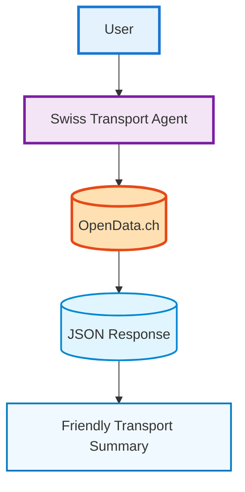

## Overview

The **Swiss Transport Chatbot** provides live public-transport connections across Switzerland — including **trains, trams, buses, ships, and cableways**.  
This recipe demonstrates **one AI agent** connected to **one function call** 
(`swiss_connection_search`).

## What you’ll build
- **Agent name:** `Swiss Transport Agent`
- **Functions (1):**
  1. `swiss_connection_search` — public-transport connections across Switzerland
  

## Prerequisites
- INNOCHAT workspace with Agent builder access.

## Quick architecture



## Steps to Build

### Step 1: Create or Edit a Customer Support Agent

**Agent Name:** `Swiss Transport Agent`

**Description:** Provides live public-transport connections in Switzerland. Users can ask for upcoming trains, buses, trams, ships, and cableway journeys between two Swiss stations, optionally specifying via-stations, travel modes, date, time, and arrival/departure preference.

<Frame>
  
</Frame>

**Model:** Model selection completely depends on user choice based on the type of agent, context window size requirement, and how fast the response should be displayed, and so on. Opt for GPT-5-mini or GPT-5-nano for faster responses.

**Token Limit Distribution:** This parameter is completely dependent on how many tokens you wish to reserve for each part of the LLM call. The overall token limit depends on the LLM you picked, but you can fine tune the token distribution based on your particular use case.

<Frame>
  
</Frame>

**Prompt:** 

```text
You are the **Swiss Transport Assistant**, an AI helper for Swiss public transport.
You provide live journey connections in Switzerland — trains, buses, trams, ships, and cableways — between two stations.
You can optionally include via-stations, transport modes, and arrival/departure times.

**What to do**:
- When a user asks for a journey (e.g. “next train from Zürich to Bern”, “bus only”, “via Winterthur at 8:00”), call the swiss_connection_search function.
- Include:
   - from and to stations
   - optional via station(s)
   - date and time (use Zurich local time, CET/CEST)
   - arrival/departure flag
   - transportModes (if specified by user)

If you can’t find results, reply:
“I’m sorry, I couldn’t find matching connections.”

**How to show results**:
When journey data is returned, summarize it in a friendly, easy-to-read format like this:

Example:
"Here are the connections from Rafz to Zurich via Winterthur: 

Dep Rafz 13:15 → Arr Zürich HB 14:25 (1h10, 2 transfers)
   -  Leg 1: S9 — Rafz (Plat 3) → Bülach (Plat 3)
   -  Leg 2: S41 — Bülach (Plat 4) → Winterthur (Plat 9) ✅ via Winterthur
   -  Leg 3: IR 75 — Winterthur (Plat 4) → Zürich HB (Plat 5)

Final platform at destination: 5
Notes: Real-time shows no major delays; minor platform or minute changes possible."

**Style & tone**:
- Summarize results clearly and friendly.
- Mention via-stations (✅ via …).
- Never mention or suggest booking or ticket purchase.
- Use Zurich local time (CET/CEST).

**Behavior guidelines**: 
- Never guess schedules — only respond with function output.
- If user asks unrelated questions, gently redirect: “I’m here to help with Swiss public transport info.”
```


**Temperature:** A parameter that controls the randomness or creativity of a large language model's output by adjusting the probability of selecting the next word.

<Frame>
  
</Frame>

### Step 2: Knowledge

Since it's a basic agent creation with single LLM call, we can skip the Knowledge section and also uncheck the all sources parameter.

<Frame>
  
</Frame>

### Step 3: Add the Function Call

**Function Name:** swiss_connection_search

**Description:** This function queries the Transport.opendata.ch API to retrieve upcoming public‑transport connections between two Swiss stations.  
Given inputs like departure and arrival station (name or ID), optional via‑stations, travel modes, date/time, and arrival/departure preference, it returns connection results. Each result includes the following fields:
- departure_time: ISO timestamp of journey start  
- arrival_time: ISO timestamp of journey end  
- duration: e.g. "0:48" (hours:minutes)  
- transfers: integer number of transfers  
- from: departure station name  
- to: arrival station name  
- platform_from: departure platform (with prognosis if available)  
- platform_to: arrival platform (with prognosis if available)  
- transport_lines: names or numbers of lines used (e.g. "IC 13", "S12")  
- capacity: optional capacities for 1st/2nd class  

<Frame>
  
</Frame>

**API Endpoint:** http://transport.opendata.ch/v1/connections

**Method:** 'GET'

<Frame>
  
</Frame>

**Parameters:**


```json
  
  {
  "type": "object",
  "properties": {
    "from": {
      "type": "string",
      "description": "Departure station name or station ID (required)."
    },
    "to": {
      "type": "string",
      "description": "Arrival station name or station ID (required)."
    },
    "via": {
      "type": "array",
      "description": "Optional up to 5 via‑stations (names or IDs). Order matters.",
      "items": {
        "type": "string"
      }
    },
    "date": {
      "type": "string",
      "description": "Optional departure/arrival date in YYYY‑MM‑DD format."
    },
    "time": {
      "type": "string",
      "pattern": "^([01]\\d|2[0‑3]):[0‑5]\\d$",
      "description": "Optional departure/arrival time in HH:MM (24‑hour)."
    },
    "isArrivalTime": {
      "type": "boolean",
      "description": "Optional. If true, the date/time refer to arrival rather than departure. Default false."
    },
    "transportations": {
      "type": "array",
      "description": "Optional transport modes to include: train, tram, bus, ship, cableway.",
      "items": {
        "type": "string",
        "enum": [
          "train",
          "tram",
          "bus",
          "ship",
          "cableway"
        ]
      }
    },
    "limit": {
      "type": "integer",
      "minimum": 1,
      "maximum": 16,
      "description": "Maximum number of connections to return (default 4)."
    },
    "page": {
      "type": "integer",
      "minimum": 0,
      "maximum": 3,
      "description": "Zero‑based pagination index."
    }
  },
  "required": [
    "from",
    "to"
  ],
  "additionalProperties": false
}  
```


<Frame>
  
</Frame>

## **Example**
### **Example Input**
> Next train from Zürich to Bern at 09:00

### **Example Output**
> Here are the next connections from Zürich to Bern:
Dep Zürich HB 09:02 → Arr Bern 10:00 (0h58, 1 transfer)

- IC8 — Zürich HB (Plat 5) → Olten (Plat 4)
- IC6 — Olten (Plat 6) → Bern (Plat 7)
  Real-time: on time.
  **If no match found:**
  >“I’m sorry, I couldn’t find matching connections.”


## Summary
| **Feature** |	**Description** |
|-------------|-----------------|
| Level | Basic |
| Agents | 1 |
| Function Calls | 1 (`swiss_connection_search`) |
| Goal | Display Swiss public-transport connections |
| Output | Friendly text summary with times, transfers, and platforms |