## Overview

A **cookbook** is a set of short, copy-pasteable guides that show how to achieve common builds with INNOCHAT. This page covers the Intermediate pattern: **one agent with two function calls**.

You’ll build **Swiss News**, a chatbot that:
- fetches top headlines for Switzerland, and
- runs keyword news searches with filters like date range, language, and source fields.
<Callout> Because we are using **function calls** for live data, **skip the Knowledge section** (no trained sources needed). </Callout>

## What you’ll build
- **Agent name:** `Swiss News`
- **Functions (2):**
  1. `getTopHeadlines` — curated/top stories
  2. `searchNews` — keyword search with filters 

## Prerequisites
- A **GNews.io API key (v4)**.
- INNOCHAT workspace with Agent builder access.

## Quick architecture

```mermaid
flowchart TD
    User[User] -->|asks question| A[🇨🇭 Swiss News Agent]
    A -->|Analyze query| L{Which function?}
    L -->|Top headlines| GH[📰 getTopHeadlines]
    L -->|Search news| SN[🔍 searchNews]
    GH -->|Request to API| API[(🌐 GNews API)]
    SN -->|Request to API| API
    API -->|Returns data| RES[(JSON Response)]
    RES --> P[Format & Present]
    P -->|Friendly summary with links| User

    style User fill:#e3f2fd,stroke:#1976d2,stroke-width:3px
    style A fill:#f3e5f5,stroke:#7b1fa2,stroke-width:3px
    style L fill:#fff4e6,stroke:#f57c00,stroke-width:3px
    style GH fill:#e8f5e9,stroke:#388e3c,stroke-width:2px
    style SN fill:#e8f5e9,stroke:#388e3c,stroke-width:2px
    style API fill:#ffe0b2,stroke:#e64a19,stroke-width:3px
    style RES fill:#e1f5ff,stroke:#0288d1,stroke-width:2px
    style P fill:#f0f9ff,stroke:#0277bd,stroke-width:2px

```

### Step-1: Create or Edit a Customer Support Agent

**Agent Name:** `Swiss News`

**Description:** As the official Swiss News Assistant, you are a knowledgeable, friendly, and professional digital helpdesk built to deliver up-to-date news about Switzerland. You specialize in retrieving articles, headlines, and insights about Swiss topics, regions, and sources via GNews.io. Your mission is to help users discover, search, and stay informed on Swiss news in their preferred language (English, German, French, or Italian), presenting content clearly, concisely, and accurately. You guide unclear queries, politely clarify or redirect non-Swiss requests, and always maintain a supportive tone.

<Frame>
  
</Frame>

**Model:** Model selection completely depends on user choice based on the type of agent, context window size requirement, and how fast the response should be displayed, and so on. Opt for GPT-5-mini or GPT-5-nano for faster responses.

**Token Limit Distribution:** This parameter is completely dependent on how many tokens you wish to reserve for each part of the LLM call. The overall token limit depends on the LLM you picked, but you can fine tune the token distribution based on your particular use case.

<Frame>
  
</Frame>

**Prompt:** 
```text
You are the Swiss News Assistant, an AI dedicated to providing users with Swiss news and headlines using the GNews.io API.

Your main responsibilities:

Handle user requests for Swiss news—including business, sports, politics, regional stories, and more.

Use getTopHeadlines for trending topics/categories, or searchNews for keyword-based queries.

Always filter news to Switzerland using country: "ch", and support news in German (de), French (fr), Italian (it), or English (en) as needed.

Display dates and times in Central European Time (CET/Europe/Zurich).

Interaction rules:

If no news matches, respond:
“I couldn’t find any Swiss news matching that—would you like to broaden your search or try a different topic or timeframe?”

If the API fails or is overloaded:
“Sorry, I’m having trouble fetching news right now. Would you like to try again later or change your filters?”

For non-Swiss or off-topic requests:
“I focus exclusively on Swiss news. Can I help you with a headline or topic about Switzerland?”

Formatting:

Present articles in a numbered list (top 5–10 unless specified), showing:

Title (bold, clickable link)
Short summary/description (italicized, truncated if lengthy)
Published: [Local CET/Zurich date/time] — Source: [Source name, clickable link]

Always respond in the user’s language.

Use a concise, polite, and professional style.
```
**Temperature:** A parameter that controls the randomness or creativity of a large language model's output by adjusting the probability of selecting the next word. In this use case, temperature has been set to 0 in order to display the retrieved content as it is without any creativity.

<Frame>
  
</Frame>

### Step 2: Knowledge

Since it's a basic agent creation with single LLM call, we can skip the Knowledge section and also uncheck the all sources parameter.
<Frame>
  
</Frame>

### Step 3: Add the Function Calls
<Frame>
  
</Frame>

#### Function call - 1: `getTopHeadlines`

**Function Name:** getTopHeadlines

**Description:** Fetch top trending news headlines about Switzerland via GNews.io, filtered by country, category, and/or language. Supports optional filters for date, keywords, number of articles, and more. Always restricted to Swiss sources.

<Frame>
  
</Frame>

**API Endpoint:** https://gnews.io/api/v4/top-headlines?apikey=YOUR_API_KEY

**Method:** `GET`

<Frame>
  
</Frame>

**Headers:**
```json
{
  "authorization": "Bearer YOUR_API_KEY"
}
```

**Parameters:**
```json
{
  "type": "object",
  "properties": {
    "category": {
      "type": "string",
      "enum": [
        "general",
        "world",
        "nation",
        "business",
        "technology",
        "entertainment",
        "sports",
        "science",
        "health"
      ],
      "description": "News category to filter."
    },
    "language": {
      "type": "string",
      "description": "2-letter language code (e.g., 'de', 'fr', 'it', 'en')."
    },
    "country": {
      "type": "string",
      "description": "2-letter country code, e.g., 'ch' for Switzerland."
    },
    "q": {
      "type": "string",
      "description": "Keyword(s) to search within headlines."
    },
    "from": {
      "type": "string",
      "description": "Start date in ISO 8601."
    },
    "to": {
      "type": "string",
      "description": "End date in ISO 8601."
    },
    "max": {
      "type": "integer",
      "description": "Number of articles to return (1–100 depending on plan)."
    },
    "page": {
      "type": "integer",
      "description": "Page number for pagination (if supported)."
    },
    "expand": {
      "type": "string",
      "enum": [
        "content"
      ],
      "description": "Return full article content; requires paid plan."
    },
    "nullable": {
      "type": "string",
      "description": "Comma-separated fields allowed to return null (e.g., 'description,content,image')."
    }
  },
  "required": [],
  "additionalProperties": false
}
```
<Frame>
  
</Frame>

#### Function call - 2: `searchNews`

**Function Name:** searchNews

**Description:** Search for up-to-date news articles from GNews.io by keyword, supporting powerful filtering by language, country of publication, date range, source fields, and more. Use this function to retrieve relevant Swiss or international news about any topic, event, or person, with results prioritized by relevance or publication date. All parameters are optional except for q (the search keyword), which is required.

<Frame>
  
</Frame>

**API Endpoint:** https://gnews.io/api/v4/search?q=example&apikey=YOUR_API_KEY

**Method:** `GET`

<Frame>
  
</Frame>

**Headers:**
```json
{
  "authorization": "Bearer YOUR_API_KEY"
}
```

**Parameters:**
```json
{
  "type": "object",
  "properties": {
    "q": {
      "type": "string",
      "description": "Search keywords (mandatory). Supports logical operators AND, OR, NOT, and exact phrases in quotes."
    },
    "lang": {
      "type": "string",
      "description": "2-letter language code to filter articles (e.g., 'de', 'fr', 'it', 'en')."
    },
    "country": {
      "type": "string",
      "description": "2-letter country code to filter sources, e.g., 'ch' for Switzerland."
    },
    "max": {
      "type": "integer",
      "description": "Number of articles to return (min 1, max 100, depending on subscription)."
    },
    "in": {
      "type": "string",
      "description": "Fields to search in (title, description, content). Comma-separated."
    },
    "nullable": {
      "type": "string",
      "description": "Fields allowed to return null (description, content, image). Comma-separated."
    },
    "from": {
      "type": "string",
      "description": "Filter articles published on or after this ISO 8601 date-time, e.g., '2025-07-18T21:32:58.500Z'."
    },
    "to": {
      "type": "string",
      "description": "Filter articles published on or before this ISO 8601 date-time."
    },
    "sortby": {
      "type": "string",
      "enum": [
        "publishedAt",
        "relevance"
      ],
      "description": "Sort order: 'publishedAt' (newest first) or 'relevance' (best match)."
    },
    "page": {
      "type": "integer",
      "description": "Page number for pagination (requires paid subscription)."
    },
    "expand": {
      "type": "string",
      "enum": [
        "content"
      ],
      "description": "Include full article content in response (requires paid plan)."
    }
  },
  "required": [
    "q"
  ],
  "additionalProperties": false
}
```

<Frame>
  
</Frame>

## **Example**

<Frame>
  
</Frame>

## **Summary**

| **Feature** | **Description** |
|--------------|-----------------|
| **Level** | Intermediate |
| **Agents** | 1 |
| **Function Calls** | 2 (`getTopHeadlines`, `searchNews`) |
| **Goal** | Provide Swiss news headlines and topic-specific articles using GNews |
| **Output** | Concise, friendly summaries with headlines and keyword-based results |